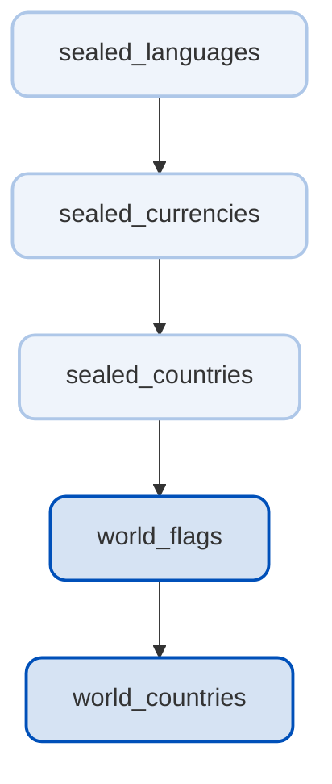

## Sealed World

Pure Dart, fully tested and ISO-driven ecosystem for the world's data in form of compile-time, tree-shakable constant sealed classes.

> [!TIP]
> Flutter packages follow a **world** prefix convention, whereas Dart packages utilize the **sealed** prefix.

| Package                                                                                          | SDK         | Description                                                               | Pub                                                                                                          |
| ------------------------------------------------------------------------------------------------ | ----------- | ------------------------------------------------------------------------- | ------------------------------------------------------------------------------------------------------------ |
| [world_countries](https://github.com/tsinis/sealed_world/tree/main/packages/world_countries)     | **Flutter** | Country/phone/currency/language pickers and APIs for typed localizations. |      |
| [world_flags](https://github.com/tsinis/sealed_world/tree/main/packages/world_flags)             | **Flutter** | Country flags built entirely with Flutter's CustomPainters.               |              |
| [sealed_countries](https://github.com/tsinis/sealed_world/tree/main/packages/sealed_countries)   | Dart        | Countries in form of compile-time constant sealed classes.                |    |
| [sealed_currencies](https://github.com/tsinis/sealed_world/tree/main/packages/sealed_currencies) | Dart        | Currencies in form of compile-time constant sealed classes.               |  |
| [sealed_languages](https://github.com/tsinis/sealed_world/tree/main/packages/sealed_languages)   | Dart        | Languages in form of compile-time constant sealed classes.                |    |

**This ecosystem exhibits a strict hierarchical dependency structure**. At the foundation are **languages and scripts**, essential for localization and translation across all packages. Building upon this, **currencies** are required for subsequent packages dealing with **countries**. The **countries** package, is necessary for rendering country **flags**, which is then needed by the **world_countries** package for displaying localized (given that a locale typically consists of three components: language, script, and region/country) country, language and currency names, and also **flags** (for example within country/phone code pickers).

