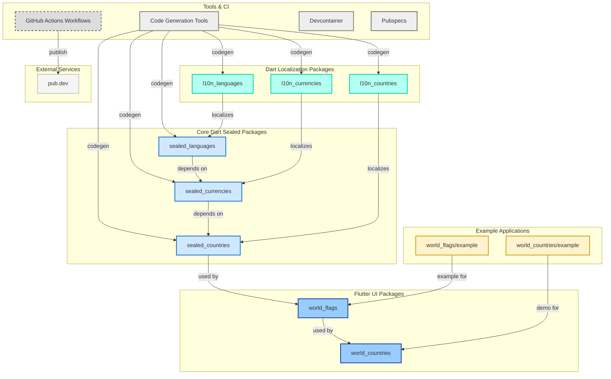

## Sealed World

A pure Dart, fully tested and ISO-driven ecosystem for the world's data in the form of compile-time, tree-shakable constant classes with a sealed origin.

> [!TIP]
> Flutter packages use **world** prefix, Dart packages use **sealed** prefix for core functionality and **l10n** prefix for localization maps.

| Package                                                                                          | SDK         | Stand-alone   | Description                                 | Pub                                                                                                          |
| ------------------------------------------------------------------------------------------------ | ----------- | ------------- | ------------------------------------------- | ------------------------------------------------------------------------------------------------------------ |
| [world_countries](https://github.com/tsinis/sealed_world/tree/main/packages/world_countries)     | **Flutter** | No            | Pickers and APIs for typed localizations    |      |
| [world_flags](https://github.com/tsinis/sealed_world/tree/main/packages/world_flags)             | **Flutter** | No            | Declarative flags built with CustomPainters |              |
| [sealed_countries](https://github.com/tsinis/sealed_world/tree/main/packages/sealed_countries)   | Dart        | No            | Countries in the form of sealed classes     |    |
| [sealed_currencies](https://github.com/tsinis/sealed_world/tree/main/packages/sealed_currencies) | Dart        | No            | Currencies in the form of sealed classes    |  |
| [sealed_languages](https://github.com/tsinis/sealed_world/tree/main/packages/sealed_languages)   | Dart        | Partially[^1] | Languages in the form of sealed classes     |    |
| [l10n_countries](https://github.com/tsinis/sealed_world/tree/main/packages/l10n_countries)       | Dart        | **Yes**       | Country names localization maps             |        |
| [l10n_currencies](https://github.com/tsinis/sealed_world/tree/main/packages/l10n_currencies)     | Dart        | **Yes**       | Currency names localization maps            |      |
| [l10n_languages](https://github.com/tsinis/sealed_world/tree/main/packages/l10n_languages)       | Dart        | **Yes**       | Language names localization maps            |        |

**This ecosystem follows a hierarchical structure** with optional localization support. At the foundation are **languages and scripts**, providing core functionality across all packages. Building upon this, **currencies** extend the system, followed by **countries**. Each core package has an optional **l10n** companion that provides localization maps. The **countries** package serves as a bridge to Flutter, enabling the rendering of country **flags**, which the **world_countries** package uses to create UI components like country pickers with localized names and visual elements.

### Versioning and Release Policy

This section explains how the ecosystem handles SDK pinning, semantic versioning, and release cadence, and why this approach benefits users and contributors.

#### SDK Compatibility and Pinning

- Pinning to the Dart version bundled with Flutter stable ensures local developer environments match CI, minimizing SDK mismatches and hard-to-reproduce issues. The Flutter SDK archive lists each Flutter stable release together with its bundled Dart version [Flutter SDK archive](https://docs.flutter.dev/install/archive).
- Production packages target Dart stable rather than beta/dev, in line with Dart's guidance to use stable for building and deploying apps [Get the Dart SDK](https://dart.dev/get-dart).
- Formatter and workspace changes introduced around Dart 3.7/3.8 can create large diffs when mixing pre/post language versions. Dart 3.8 includes a rewritten/updated formatter behavior; formatting changes apply when the package opts into the newer language version [Announcing Dart 3.8](https://blog.dart.dev/announcing-dart-3-8-724eaaec9f47), [Breaking changes (formatter behavior >=3.8)](https://dart.dev/resources/breaking-changes).

#### Semantic Versioning

- Semantic Versioning is followed: MAJOR for breaking changes, MINOR for new features, PATCH for bug fixes [Semantic Versioning](https://semver.org/).
- Dart's pub ecosystem applies SemVer for resolution and documents conventions including pre-1.0 handling and "next breaking" logic [Package versioning](https://dart.dev/tools/pub/versioning).

#### Release Cadence

- Major releases: approximately once per year, potentially including breaking changes; aligned after Flutter/Dart stable cycles to reduce churn [Semantic Versioning](https://semver.org/).
- Minor releases: about once per month for feature additions (especially for Flutter-facing packages), without breaking changes [Package versioning](https://dart.dev/tools/pub/versioning).
- Patch releases: as needed for fixes and docs, with no API changes [Package versioning](https://dart.dev/tools/pub/versioning).

#### Deprecation-First Policy

- Most breaking changes are introduced via deprecation first, with warnings and migration time provided before removal. This mirrors Dart and Flutter practices of listing deprecations alongside breaking changes and offering migration guides [Breaking changes and deprecations (Dart)](https://dart.dev/resources/breaking-changes), [Flutter breaking changes and migration guides](https://docs.flutter.dev/release/breaking-changes).
- Deprecated APIs are removed only after reaching end of life in a subsequent stable release cycle, consistent with Flutter's deprecation policy and examples across releases (e.g., removals after 3.7, 3.13, 3.19).
- Migration guidance is linked in release notes for major removals, reducing friction and helping teams adopt changes in predictable windows [Flutter breaking changes and migration guides](https://docs.flutter.dev/release/breaking-changes).

#### Rationale

- Aligning with Flutter stable's Dart ensures consistent environments across CI and contributors, reducing surprise failures and easing support [Flutter SDK archive](https://docs.flutter.dev/install/archive).

#### Benchmark & regression verification system

This package includes an automated benchmark system that runs on every release to detect performance regressions. Each version produces immutable JSON artifacts containing build metadata (APK size, toolchain versions, Android configuration) and runtime metrics (startup time, frame performance, memory and CPU usage, etc.).

> [!TIP]
> These artifacts are attached to [GitHub Releases](https://github.com/tsinis/sealed_world/releases) and committed to the repository, enabling historical comparison and transparent performance tracking across versions. The benchmark flow uses **low-end physical ARM64 Android** devices with Flashlight + Maestro for reproducible, device-driven testing.

To run benchmarks locally or learn more about the system, see the [benchmarks documentation](../packages/world_countries/example/benchmarks/README.md). Execute the shared CLI via `dart run tools/bin/benchmarks.dart $package_name` (or `cd tools && dart run :benchmarks $package_name`). Current targets include all Flutter packages. All benchmark data is immutable and versioned, ensuring full auditability and regression traceability.

[^1]: While `sealed_languages` technically depends on `l10n_languages` for localization, this is not part of its core functionality. The package primarily serves as the backbone for all `sealed_*` and `world_*` packages by providing typed locale classes and extensions that power localization maps across the entire ecosystem.
