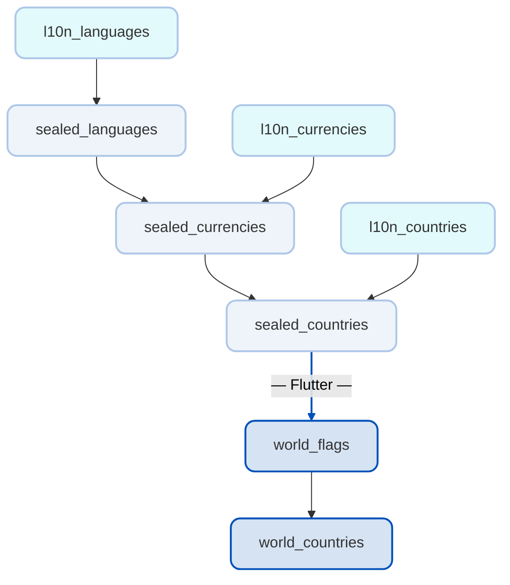

## Sealed World

A pure Dart, fully tested and ISO-driven ecosystem for the world's data in the form of compile-time, tree-shakable constant classes with a sealed origin.

> [!TIP]
> Flutter packages use **world** prefix, Dart packages use **sealed** prefix for core functionality and **l10n** prefix for localization maps.

| Package                                                                                          | SDK         | Stand-alone   | Description                              | Pub                                                                                                          |
| ------------------------------------------------------------------------------------------------ | ----------- | ------------- | ---------------------------------------- | ------------------------------------------------------------------------------------------------------------ |
| [world_countries](https://github.com/tsinis/sealed_world/tree/main/packages/world_countries)     | **Flutter** | No            | Pickers and APIs for typed localizations |      |
| [world_flags](https://github.com/tsinis/sealed_world/tree/main/packages/world_flags)             | **Flutter** | No            | Country flags built with CustomPainters  |              |
| [sealed_countries](https://github.com/tsinis/sealed_world/tree/main/packages/sealed_countries)   | Dart        | No            | Countries in the form of sealed classes  |    |
| [sealed_currencies](https://github.com/tsinis/sealed_world/tree/main/packages/sealed_currencies) | Dart        | No            | Currencies in the form of sealed classes |  |
| [sealed_languages](https://github.com/tsinis/sealed_world/tree/main/packages/sealed_languages)   | Dart        | Partially[^1] | Languages in the form of sealed classes  |    |
| [l10n_countries](https://github.com/tsinis/sealed_world/tree/main/packages/l10n_countries)       | Dart        | **Yes**       | Country names localization maps          |        |
| [l10n_currencies](https://github.com/tsinis/sealed_world/tree/main/packages/l10n_currencies)     | Dart        | **Yes**       | Currency names localization maps         |      |
| [l10n_languages](https://github.com/tsinis/sealed_world/tree/main/packages/l10n_languages)       | Dart        | **Yes**       | Language names localization maps         |        |

**This ecosystem follows a hierarchical structure** with optional localization support. At the foundation are **languages and scripts**, providing core functionality across all packages. Building upon this, **currencies** extend the system, followed by **countries**. Each core package has an optional **l10n** companion that provides localization maps. The **countries** package serves as a bridge to Flutter, enabling the rendering of country **flags**, which the **world_countries** package uses to create UI components like country pickers with localized names and visual elements.

[^1]: While `sealed_languages` technically depends on `l10n_languages` for localization, this is not part of its core functionality. The package primarily serves as the backbone for all `sealed_*` and `world_*` packages by providing typed locale classes and extensions that power localization maps across the entire ecosystem.
